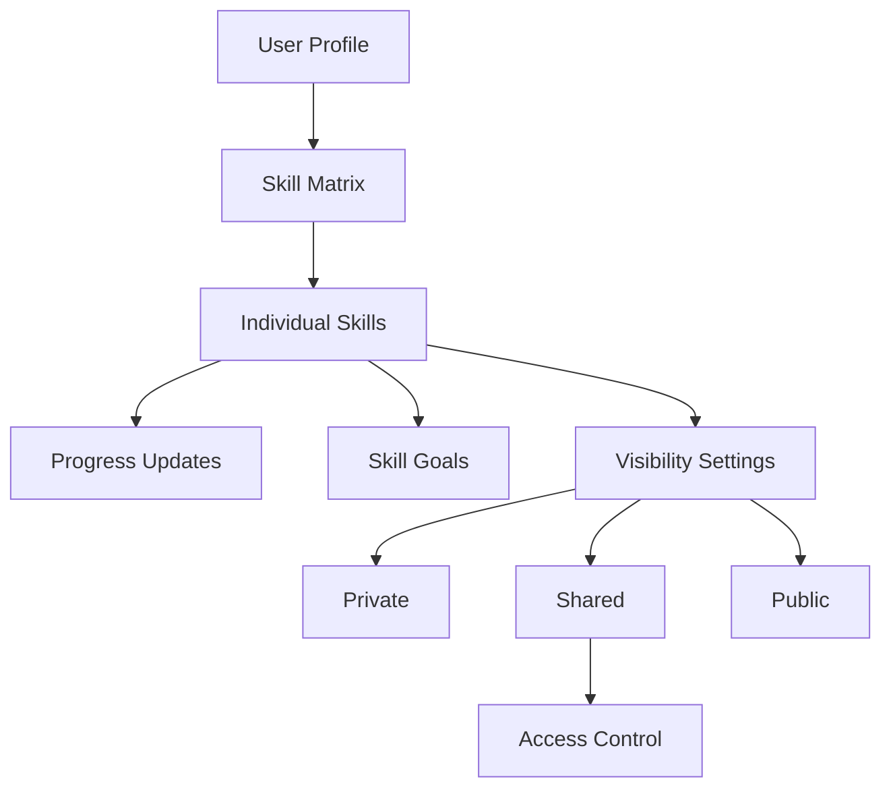

# SkillGrid Growth Tracker

A decentralized skill development tracking platform built on the Stacks blockchain that enables users to define, track, and showcase their professional growth journey with verifiable proof of progress.

## Overview

SkillGrid Growth Tracker allows users to:
- Create personalized skill matrices with detailed proficiency tracking
- Record progress updates with evidence and milestones
- Set and track skill development goals
- Control visibility of skills (private, shared, or public)
- Share progress with specific users or publicly
- Maintain an immutable record of skill development

The platform combines personal development tracking with social accountability features while ensuring users maintain complete ownership of their data through blockchain technology.

## Architecture

The system is built around a main smart contract that manages user profiles, skills, progress tracking, and access control.



### Core Components:
- **User Profiles**: Basic user information and skill count
- **Skills**: Individual skill definitions with metadata
- **Progress Updates**: Historical tracking of skill development
- **Goals**: Target proficiency levels with deadlines
- **Access Control**: Granular visibility management

## Contract Documentation

### skill-grid.clar

The main contract handling all platform functionality.

#### Key Features:
- User profile management
- Skill creation and updates
- Progress tracking
- Goal setting and completion
- Access control for skill visibility

#### Permission Levels:
- Owner: Full control over their skills and access settings
- Shared Access: Specific users granted access to view skills
- Public: Anyone can view publicly marked skills

## Getting Started

### Prerequisites
- Clarinet
- Stacks wallet

### Installation

1. Clone the repository
2. Install dependencies
```bash
clarinet install
```

### Basic Usage

1. Initialize user profile:
```clarity
(contract-call? .skill-grid initialize-user)
```

2. Add a new skill:
```clarity
(contract-call? .skill-grid add-skill "JavaScript" "Programming" "Modern JavaScript development" u1 u3)
```

3. Update skill progress:
```clarity
(contract-call? .skill-grid update-skill-progress u1 u4 "Completed advanced course" "Advanced certification")
```

## Function Reference

### User Management
- `initialize-user`: Create a new user profile
- `grant-access`: Grant specific user access to view skills
- `revoke-access`: Remove user access

### Skill Management
- `add-skill`: Create a new skill entry
- `update-skill-progress`: Update skill proficiency with evidence
- `set-skill-visibility`: Change skill visibility settings

### Goal Tracking
- `set-skill-goal`: Create a new skill development goal
- `complete-goal`: Mark a goal as achieved

### Query Functions
- `get-user-info`: Retrieve user profile data
- `get-skill`: Get skill details
- `get-skill-updates`: View skill progress history
- `get-skill-goals`: Retrieve skill goals

## Development

### Testing
Run the test suite:
```bash
clarinet test
```

### Local Development
1. Start Clarinet console:
```bash
clarinet console
```

2. Deploy contracts:
```bash
clarinet deploy
```

## Security Considerations

### Data Privacy
- Private skills are only accessible to the owner
- Shared access must be explicitly granted
- Public skills are visible to anyone

### Limitations
- Proficiency levels are limited to 1-5
- Goals cannot be set in the past
- Update evidence and milestones are immutable once recorded

### Best Practices
- Regularly review shared access permissions
- Verify visibility settings before publishing updates
- Include verifiable evidence when updating progress